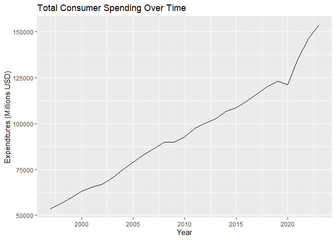

DS 202 Final Project
================

<!-- README.md is generated from README.Rmd. Please edit the README.Rmd file -->

This repository serves as a starter repo for your final project, and
this Rmd is supposed to serve as a starter file for your project report.

## Part I: Repo Structure

The structure sketched out below is an idea of what your repository
might look like. You can use it as a starting base and change according
to your needs. But think about the changes that you make!

    -- code
    |   |   -- any R scripts you need but don't want to include directly in the write-up
    -- data
    |   |   -- csv files (cleaned data)
    -- data-raw
    |   |   -- raw data files 
    |   |   -- data description files, origin
    |   |   -- Codebook
    -- final-project.Rmd
    -- images  # only images that are not created by the Rmd
    -- LICENSE
    -- README.md
    -- README.Rmd
    -- README_files # folder with files created during the knitting process

## Part II: Project report

# Title of your project

Authors: Kylie Tauke, Jordyn Reimer, and Akshat Valse

## Abstract (TL;DR)

The data explored in this project details estimates on consumer spending
in the state of Iowa. We wanted to identify what consumers spend the
most on and how it has changed throughout the years. The data comes from
the U.S. Bureau of Economic Analysis.

ADD FINDINGS LATER

# Intro/Background/Motivation

What is the topic of your project, why is it relevant?

At the end of the Intro, write a sentence describing what each of the
(result) sections is about, e.g. in section [Results 1](#results-1) we
show the relationship between XXX and YYY, section [Results
2](#results-2) also considers the effect of variable ZZZ. … Finally we
conclude with a quick summary of our findings and potential follow-up
work in section [Conclusions](#conclusions).

# Quick Data Summary

What are the variables that you will be using in the main part of the
report? What are their ranges? You could include a table with variable
names, a short explanation, and (very broad) summary statistics.

# Results

Each line of exploration is supposed to be featured in one of the
Results sections. Make sure to change to more interesting section
headers!

## Results 1

In your write-up, make sure to refer to all of the figures you create.
You can include a hyperlink to the [scatterplot](#fig:scatterplot) by
using the name of the code chunk (make sure, to give each code chunk a
different name). In your markdown document you can create this link
either by calling the function `chunkref` with the name of the code
chunk in quotes, i.e. `r chunkref("scatterplot")` or by using the
markdown expression `[scatterplot](#fig:scatterplot)`. Similarly, we can
refer to the [2nd scatterplot](#fig:2nd%20scatterplot). Note that the
figure captions appear above the figures - this saves us from having to
scroll up after following the link.

<small><strong><a name='fig:scatterplot'>scatterplot</a></strong>: This
is the figure caption. Make sure to use the description we practised in
the homework: first sentence describes structure of the plot, second
sentence describes main finding, third sentence describes
outliers/follow-up.</small>

<figure>

<figcaption aria-hidden="true">This is the figure caption. Make sure to
use the description we practised in the homework: first sentence
describes structure of the plot, second sentence describes main finding,
third sentence describes outliers/follow-up.</figcaption>
</figure>

<small><strong><a name='fig:2nd scatterplot'>2nd
scatterplot</a></strong>: This is the figure caption. Make sure to use
the description we practised in the homework: first sentence describes
structure of the plot, second sentence describes main finding, third
sentence describes outliers/follow-up.</small>

<figure>

<figcaption aria-hidden="true">This is the figure caption. Make sure to
use the description we practised in the homework: first sentence
describes structure of the plot, second sentence describes main finding,
third sentence describes outliers/follow-up.</figcaption>
</figure>

Additionally, you can also refer to different sections in your writeup
by using anchors (links) to section headers. Here, we are referring to
subsection [Results 3](#results-3). The code for that is `[Results 3]`.

## Results 2

## Results 3

…

# Conclusions

Give a quick summary of your work. Here is the place to be a bit
critical and discuss potential limitations. Add a sentence on what else
you would have liked to include in your data exploration if you had more
time or more members in your team.

## Data source

Where does the data come from, who owns the data? Where are all the
scripts that you need to clean the data?

## References

List all resources you used.
