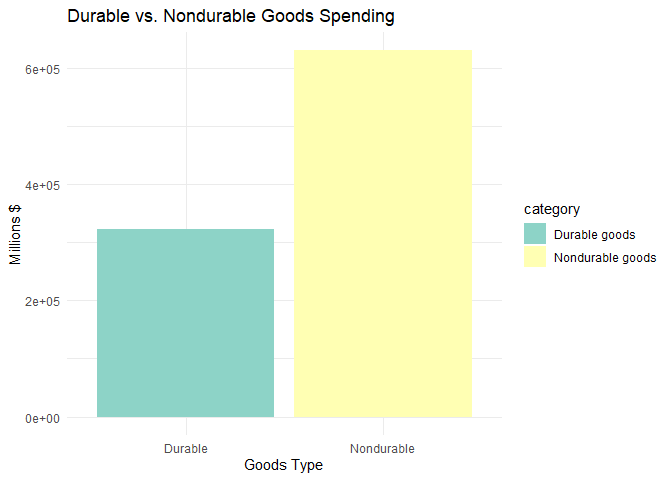
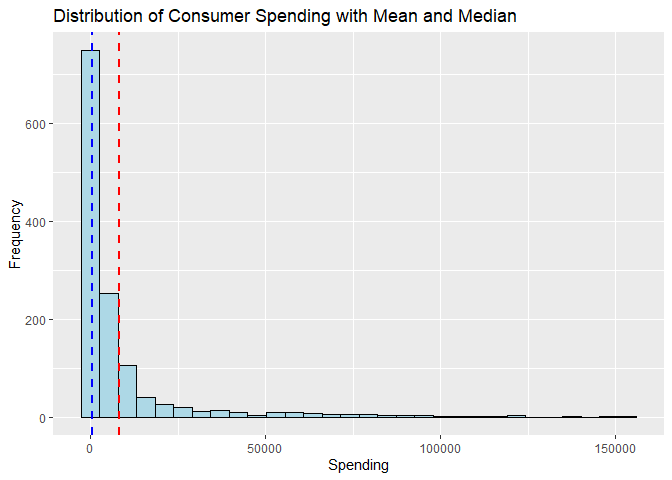

DS 202 Final Project
================

<!-- README.md is generated from README.Rmd. Please edit the README.Rmd file -->

## Part I: Project report

# Analysis of Consumer Spending in Iowa

Authors: Kylie Tauke, Jordyn Reimer, and Akshat Valse

## Abstract (TL;DR)

The data explored in this project details estimates on consumer spending
in the state of Iowa. We wanted to identify what consumers spend the
most on and how it has changed throughout the years. The data comes from
the U.S. Bureau of Economic Analysis.

ADD FINDINGS LATER

THINGS TO NOTE - page number on slide - facet by categorical variables -
not too much text on slides - he’s kinda picky on what type of figure
you use - stacked vs dodge bar chart - percent vs count bar chart

# Motivation

We wanted to examine consumer spending in Iowa. Not only were we curious
about the distribution of spending among different categories of goods
and services, but this is also valuable information for any business
providing a good or service.

At the end of the Intro, write a sentence describing what each of the
(result) sections is about, e.g. in section \[Results 1\] we show the
relationship between XXX and YYY, section \[Results 2: Modeling Using
Random Forests\] also considers the effect of variable ZZZ. … Finally we
conclude with a quick summary of our findings and potential follow-up
work in section [Conclusions](#conclusions).

# Quick Data Summary

- The data was cleaned by standardizing column names, extracting
  simplified categories from text fields, splitting composite IDs into
  separate columns, converting data types (dates, numbers), normalizing
  units to millions, and removing duplicates.

- The primary variables that will be used will be category, which
  includes the type of good and/or service; reported_year, which is the
  year the consumer data was reported; and value, which contains the
  amount of money spent for a specific category and year.

<!-- -->

    ##     row_id           fips_code           data_year    series_code       
    ##  Length:1296        Length:1296        Min.   :1997   Length:1296       
    ##  Class :character   Class :character   1st Qu.:2003   Class :character  
    ##  Mode  :character   Mode  :character   Median :2010   Mode  :character  
    ##                                        Mean   :2010                     
    ##                                        3rd Qu.:2017                     
    ##                                        Max.   :2023                     
    ##                                                                         
    ##   frequency         variable_code        variable         consumption_category
    ##  Length:1296        Length:1296        Length:1296        Length:1296         
    ##  Class :character   Class :character   Class :character   Class :character    
    ##  Mode  :character   Mode  :character   Mode  :character   Mode  :character    
    ##                                                                               
    ##                                                                               
    ##                                                                               
    ##                                                                               
    ##      value        variable_unit           date            reported_year 
    ##  Min.   :   297   Length:1296        Min.   :1997-12-31   Min.   :1997  
    ##  1st Qu.:  1905   Class :character   1st Qu.:2003-12-31   1st Qu.:2003  
    ##  Median :  3959   Mode  :character   Median :2010-12-31   Median :2010  
    ##  Mean   : 10928                      Mean   :2010-12-31   Mean   :2010  
    ##  3rd Qu.: 10263                      3rd Qu.:2017-12-31   3rd Qu.:2017  
    ##  Max.   :153400                      Max.   :2023-12-31   Max.   :2023  
    ##                                                                         
    ##    prior_year  
    ##  Min.   :1996  
    ##  1st Qu.:2002  
    ##  Median :2009  
    ##  Mean   :2009  
    ##  3rd Qu.:2016  
    ##  Max.   :2022  
    ##                
    ##                                                                                  category  
    ##  Clothing and footwear                                                               : 54  
    ##  Durable goods                                                                       : 54  
    ##  Final consumption expenditures of nonprofit institutions serving households (NPISHs): 54  
    ##  Financial services and insurance                                                    : 54  
    ##  Food and beverages purchased for off-premises consumption                           : 54  
    ##  Food services and accommodations                                                    : 54  
    ##  (Other)                                                                             :972  
    ##    expenditure_type     unit           value_millions    
    ##  per_capita:648     Length:1296        Min.   :     0.0  
    ##  total     :648     Class :character   1st Qu.:     0.0  
    ##                     Mode  :character   Median :   428.8  
    ##                                        Mean   :  8248.7  
    ##                                        3rd Qu.:  6952.5  
    ##                                        Max.   :153399.7  
    ## 

# Results

## Kylie’s Analysis

    ## `summarise()` has grouped output by 'type'. You can override using the
    ## `.groups` argument.

<!-- -->

Generally, services have higher consumer expenditures than goods do.
However, we see a drop in service expenditures in 2020, and an increase
in goods expenditures in the following year. COVID clearly impacted
consumer spending. Some possible reasons for this could be a drop in
consumer demand for services during the quarantine period, price
increases due to the economy taking a hit during COVID, consumers
stockpiling assorted goods, and more.

<!-- -->

Looking only at goods, nearly every type of good has a relatively steady
increase as time goes on. Some goods, such as clothing, gasoline, and
various durable goods saw a drop in consumer spending in 2020, while
others like food, recreational goods, and other nondurable goods saw an
increase in 2020, so COVID definitely had an impact on consumer
spending. Clearly, gasoline has the most variance in consumer spending,
which makes sense since although demand for gas is probably steady, gas
prices vary a lot.

<!-- -->

Looking at these box plots, it’s clear why service spending is higher
than goods spending. Health care and housing/utilities dominate consumer
spending overall. Then, the next items that consumers spend the most on
are grocery items, included in miscellaneous nondurable goods and also
food and beverages.

## Jordyn’s Analysis

<!-- -->

This suggests a greater share of consumer or economic expenditure goes
toward short-lived products (food, fuel, clothing) compared to
long-lasting items (appliances, cars).

    ## Warning: Using `size` aesthetic for lines was deprecated in ggplot2 3.4.0.
    ## ℹ Please use `linewidth` instead.
    ## This warning is displayed once every 8 hours.
    ## Call `lifecycle::last_lifecycle_warnings()` to see where this warning was
    ## generated.

<!-- -->

Typical consumer spending is relatively low, as indicated by the high
frequency of small values and the lower median. The average spending is
misleading as a measure of central tendency here due to a few high
spenders skewing the data. Median is a better indicator of typical
consumer behavior in this dataset. Policy or marketing strategies should
consider the skewness as most consumers behave differently from the few
big spenders.

    ## `geom_smooth()` using formula = 'y ~ x'

<!-- --> Both total
and per capita expenditures exhibit a consistent upward trend over the
entire period, indicating increasing spending over time. The growth for
total appears to accelerate more steeply after 2015, suggesting either
increased population, inflation, or expanded services. Although
per_capita is growing steadily, it shows a more gradual slope compared
to total expenditure.

## AK’s Analysis

In your write-up, make sure to refer to all of the figures you create.
You can include a hyperlink to the [scatterplot](#fig:scatterplot) by
using the name of the code chunk (make sure, to give each code chunk a
different name). In your markdown document you can create this link
either by calling the function `chunkref` with the name of the code
chunk in quotes, i.e. [scatterplot](#fig:scatterplot) or by using the
markdown expression `[scatterplot](#fig:scatterplot)`. Similarly, we can
refer to the [2nd scatterplot](#fig:2nd%20scatterplot). Note that the
figure captions appear above the figures - this saves us from having to
scroll up after following the link.

<small><strong><a name='fig:scatterplot'>scatterplot</a></strong>: This
is the figure caption. Make sure to use the description we practised in
the homework: first sentence describes structure of the plot, second
sentence describes main finding, third sentence describes
outliers/follow-up.</small>

<figure>

<figcaption aria-hidden="true">This is the figure caption. Make sure to
use the description we practised in the homework: first sentence
describes structure of the plot, second sentence describes main finding,
third sentence describes outliers/follow-up.</figcaption>
</figure>

<small><strong><a name='fig:2nd scatterplot'>2nd
scatterplot</a></strong>: This is the figure caption. Make sure to use
the description we practised in the homework: first sentence describes
structure of the plot, second sentence describes main finding, third
sentence describes outliers/follow-up.</small>

<figure>

<figcaption aria-hidden="true">This is the figure caption. Make sure to
use the description we practised in the homework: first sentence
describes structure of the plot, second sentence describes main finding,
third sentence describes outliers/follow-up.</figcaption>
</figure>

Additionally, you can also refer to different sections in your writeup
by using anchors (links) to section headers. Here, we are referring to
subsection \[Results 3: Volatility in Spending Categories Over Time\].
The code for that is `[Results 3]`.

## AK’s Model: Modeling Using Random Forests

    ## `geom_smooth()` using formula = 'y ~ x'

<!-- -->

<!-- -->

## AK’s Heatmap: Volatility in Spending Categories Over Time

<!-- -->

# Conclusions

Give a quick summary of your work. Here is the place to be a bit
critical and discuss potential limitations. Add a sentence on what else
you would have liked to include in your data exploration if you had more
time or more members in your team.

- In this project, we explored consumer spending patterns in Iowa using
  data from the U.S. Bureau of Economic Analysis. We analyzed overall
  spending trends over time, built a random forest model to predict
  spending categories based on expenditure and year, and visualized
  shifts in major spending categories through a heatmap. Our results
  show that total consumer spending in Iowa has steadily increased over
  the past two decades, with essential categories like healthcare and
  housing consistently dominating expenditure. Meanwhile, discretionary
  categories such as food services and recreation displayed greater
  volatility.

  One limitation of our analysis is that we did not adjust spending
  figures for inflation or population growth, which could affect
  year-to-year comparisons. Additionally, our predictive model only used
  two variables incorporating more economic indicators (such as
  unemployment rates, income levels, or demographic shifts) might
  improve model accuracy and interpretation.

  If we had more time or additional team members, we would have liked to
  build a forecasting model to predict future consumer spending by
  category. We also would have explored spatial differences across
  counties in Iowa to investigate whether spending patterns vary
  geographically within the state.

## Data source

Where does the data come from, who owns the data? Where are all the
scripts that you need to clean the data?

## References

List all resources you used.
