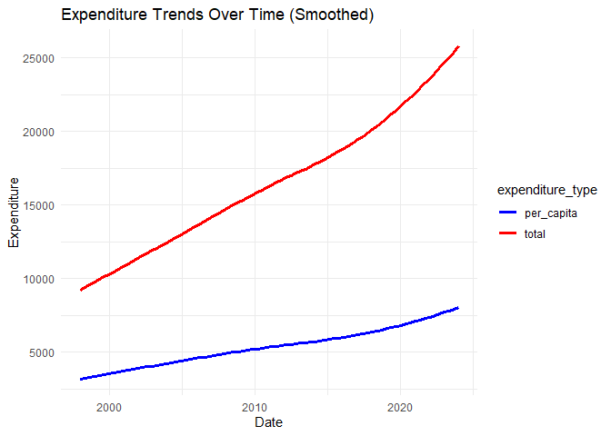

DS 202 Final Project
================

<!-- README.md is generated from README.Rmd. Please edit the README.Rmd file -->

This repository serves as a starter repo for your final project, and
this Rmd is supposed to serve as a starter file for your project report.

## Part I: Repo Structure

The structure sketched out below is an idea of what your repository
might look like. You can use it as a starting base and change according
to your needs. But think about the changes that you make!

    -- code
    |   |   -- any R scripts you need but don't want to include directly in the write-up
    -- data
    |   |   -- csv files (cleaned data)
    -- data-raw
    |   |   -- raw data files 
    |   |   -- data description files, origin
    |   |   -- Codebook
    -- final-project.Rmd
    -- images  # only images that are not created by the Rmd
    -- LICENSE
    -- README.md
    -- README.Rmd
    -- README_files # folder with files created during the knitting process

## Part II: Project report

# Consumer Spending in Iowa

Authors: Kylie Tauke, Jordyn Reimer, and Akshat Valse

## Abstract (TL;DR)

The data explored in this project details estimates on consumer spending
in the state of Iowa. We wanted to identify what consumers spend the
most on and how it has changed throughout the years. The data comes from
the U.S. Bureau of Economic Analysis.

ADD FINDINGS LATER

THINGS TO NOTE - page number on slide - facet by categorical variables -
not too much text on slides - he’s kinda picky on what type of figure
you use - stacked vs dodge bar chart - percent vs count bar chart

# Motivation

We wanted to examine consumer spending in Iowa. Not only were we curious
about the distribution of spending among different categories of goods,
but this is also valuable information for any business providing a good
or service.

At the end of the Intro, write a sentence describing what each of the
(result) sections is about, e.g. in section [Results 1](#results-1) we
show the relationship between XXX and YYY, section [Results 2: Modeling
Using Random Forests](#results-2-modeling-using-random-forests) also
considers the effect of variable ZZZ. … Finally we conclude with a quick
summary of our findings and potential follow-up work in section
[Conclusions](#conclusions).

# Quick Data Summary

- The data was cleaned by standardizing column names, extracting
  simplified categories from text fields, splitting composite IDs into
  separate columns, converting data types (dates, numbers), normalizing
  units to millions, and removing duplicates.

What are the variables that you will be using in the main part of the
report? What are their ranges? You could include a table with variable
names, a short explanation, and (very broad) summary statistics.

- The primary variables that will be used will be consumption_category,
  reported_year, and value_millions. Some summaries and preliminary
  plots are provided below.

<!-- -->

    ##     row_id           fips_code           data_year    series_code       
    ##  Length:1296        Length:1296        Min.   :1997   Length:1296       
    ##  Class :character   Class :character   1st Qu.:2003   Class :character  
    ##  Mode  :character   Mode  :character   Median :2010   Mode  :character  
    ##                                        Mean   :2010                     
    ##                                        3rd Qu.:2017                     
    ##                                        Max.   :2023                     
    ##   frequency         variable_code        variable         consumption_category
    ##  Length:1296        Length:1296        Length:1296        Length:1296         
    ##  Class :character   Class :character   Class :character   Class :character    
    ##  Mode  :character   Mode  :character   Mode  :character   Mode  :character    
    ##                                                                               
    ##                                                                               
    ##                                                                               
    ##      value        variable_unit           date            reported_year 
    ##  Min.   :   297   Length:1296        Min.   :1997-12-31   Min.   :1997  
    ##  1st Qu.:  1905   Class :character   1st Qu.:2003-12-31   1st Qu.:2003  
    ##  Median :  3959   Mode  :character   Median :2010-12-31   Median :2010  
    ##  Mean   : 10928                      Mean   :2010-12-31   Mean   :2010  
    ##  3rd Qu.: 10263                      3rd Qu.:2017-12-31   3rd Qu.:2017  
    ##  Max.   :153400                      Max.   :2023-12-31   Max.   :2023  
    ##    prior_year     category         expenditure_type       unit          
    ##  Min.   :1996   Length:1296        Length:1296        Length:1296       
    ##  1st Qu.:2002   Class :character   Class :character   Class :character  
    ##  Median :2009   Mode  :character   Mode  :character   Mode  :character  
    ##  Mean   :2009                                                           
    ##  3rd Qu.:2016                                                           
    ##  Max.   :2022                                                           
    ##  value_millions    
    ##  Min.   :     0.0  
    ##  1st Qu.:     0.0  
    ##  Median :   428.8  
    ##  Mean   :  8248.7  
    ##  3rd Qu.:  6952.5  
    ##  Max.   :153399.7

<!-- --><!-- -->

# Results

Each line of exploration is supposed to be featured in one of the
Results sections. Make sure to change to more interesting section
headers!

## Results 1

In your write-up, make sure to refer to all of the figures you create.
You can include a hyperlink to the [scatterplot](#fig:scatterplot) by
using the name of the code chunk (make sure, to give each code chunk a
different name). In your markdown document you can create this link
either by calling the function `chunkref` with the name of the code
chunk in quotes, i.e. [scatterplot](#fig:scatterplot) or by using the
markdown expression `[scatterplot](#fig:scatterplot)`. Similarly, we can
refer to the [2nd scatterplot](#fig:2nd%20scatterplot). Note that the
figure captions appear above the figures - this saves us from having to
scroll up after following the link.

<small><strong><a name='fig:scatterplot'>scatterplot</a></strong>: This
is the figure caption. Make sure to use the description we practised in
the homework: first sentence describes structure of the plot, second
sentence describes main finding, third sentence describes
outliers/follow-up.</small>

<figure>

<figcaption aria-hidden="true">This is the figure caption. Make sure to
use the description we practised in the homework: first sentence
describes structure of the plot, second sentence describes main finding,
third sentence describes outliers/follow-up.</figcaption>
</figure>

<small><strong><a name='fig:2nd scatterplot'>2nd
scatterplot</a></strong>: This is the figure caption. Make sure to use
the description we practised in the homework: first sentence describes
structure of the plot, second sentence describes main finding, third
sentence describes outliers/follow-up.</small>

<figure>

<figcaption aria-hidden="true">This is the figure caption. Make sure to
use the description we practised in the homework: first sentence
describes structure of the plot, second sentence describes main finding,
third sentence describes outliers/follow-up.</figcaption>
</figure>

Additionally, you can also refer to different sections in your writeup
by using anchors (links) to section headers. Here, we are referring to
subsection [Results 3: Volatility in Spending Categories Over
Time](#results-3-volatility-in-spending-categories-over-time). The code
for that is `[Results 3]`.

## Results 2: Modeling Using Random Forests

    ## Warning: package 'randomForest' was built under R version 4.4.3

    ## randomForest 4.7-1.2

    ## Type rfNews() to see new features/changes/bug fixes.

    ## 
    ## Attaching package: 'randomForest'

    ## The following object is masked from 'package:dplyr':
    ## 
    ##     combine

    ## The following object is masked from 'package:ggplot2':
    ## 
    ##     margin

    ## 
    ## Call:
    ##  randomForest(formula = category ~ reported_year + value_millions,      data = train_data, ntree = 500, importance = TRUE) 
    ##                Type of random forest: classification
    ##                      Number of trees: 500
    ## No. of variables tried at each split: 1
    ## 
    ##         OOB estimate of  error rate: 64.81%
    ## Confusion matrix:
    ##                                                                                      Clothing and footwear
    ## Clothing and footwear                                                                                   15
    ## Durable goods                                                                                            0
    ## Final consumption expenditures of nonprofit institutions serving households (NPISHs)                     8
    ## Financial services and insurance                                                                         0
    ## Food and beverages purchased for off-premises consumption                                                0
    ## Food services and accommodations                                                                         0
    ## Furnishings and durable household equipment                                                             15
    ## Gasoline and other energy goods                                                                          6
    ## Goods                                                                                                    0
    ## Gross output of nonprofit institutions                                                                   0
    ##                                                                                      Durable goods
    ## Clothing and footwear                                                                            0
    ## Durable goods                                                                                   17
    ## Final consumption expenditures of nonprofit institutions serving households (NPISHs)             0
    ## Financial services and insurance                                                                 0
    ## Food and beverages purchased for off-premises consumption                                        0
    ## Food services and accommodations                                                                 0
    ## Furnishings and durable household equipment                                                      0
    ## Gasoline and other energy goods                                                                  0
    ## Goods                                                                                            4
    ## Gross output of nonprofit institutions                                                          25
    ##                                                                                      Final consumption expenditures of nonprofit institutions serving households (NPISHs)
    ## Clothing and footwear                                                                                                                                                   7
    ## Durable goods                                                                                                                                                           0
    ## Final consumption expenditures of nonprofit institutions serving households (NPISHs)                                                                                   18
    ## Financial services and insurance                                                                                                                                        0
    ## Food and beverages purchased for off-premises consumption                                                                                                               0
    ## Food services and accommodations                                                                                                                                        0
    ## Furnishings and durable household equipment                                                                                                                             3
    ## Gasoline and other energy goods                                                                                                                                        15
    ## Goods                                                                                                                                                                   0
    ## Gross output of nonprofit institutions                                                                                                                                  0
    ##                                                                                      Financial services and insurance
    ## Clothing and footwear                                                                                               0
    ## Durable goods                                                                                                       1
    ## Final consumption expenditures of nonprofit institutions serving households (NPISHs)                                0
    ## Financial services and insurance                                                                                    5
    ## Food and beverages purchased for off-premises consumption                                                          11
    ## Food services and accommodations                                                                                   34
    ## Furnishings and durable household equipment                                                                         0
    ## Gasoline and other energy goods                                                                                     5
    ## Goods                                                                                                               1
    ## Gross output of nonprofit institutions                                                                              1
    ##                                                                                      Food and beverages purchased for off-premises consumption
    ## Clothing and footwear                                                                                                                        0
    ## Durable goods                                                                                                                                0
    ## Final consumption expenditures of nonprofit institutions serving households (NPISHs)                                                         0
    ## Financial services and insurance                                                                                                             7
    ## Food and beverages purchased for off-premises consumption                                                                                   27
    ## Food services and accommodations                                                                                                             1
    ## Furnishings and durable household equipment                                                                                                  0
    ## Gasoline and other energy goods                                                                                                              0
    ## Goods                                                                                                                                        0
    ## Gross output of nonprofit institutions                                                                                                       4
    ##                                                                                      Food services and accommodations
    ## Clothing and footwear                                                                                               1
    ## Durable goods                                                                                                       0
    ## Final consumption expenditures of nonprofit institutions serving households (NPISHs)                                1
    ## Financial services and insurance                                                                                   31
    ## Food and beverages purchased for off-premises consumption                                                           2
    ## Food services and accommodations                                                                                    1
    ## Furnishings and durable household equipment                                                                         0
    ## Gasoline and other energy goods                                                                                    14
    ## Goods                                                                                                               0
    ## Gross output of nonprofit institutions                                                                              0
    ##                                                                                      Furnishings and durable household equipment
    ## Clothing and footwear                                                                                                         14
    ## Durable goods                                                                                                                  0
    ## Final consumption expenditures of nonprofit institutions serving households (NPISHs)                                           3
    ## Financial services and insurance                                                                                               0
    ## Food and beverages purchased for off-premises consumption                                                                      0
    ## Food services and accommodations                                                                                               0
    ## Furnishings and durable household equipment                                                                                   22
    ## Gasoline and other energy goods                                                                                                2
    ## Goods                                                                                                                          0
    ## Gross output of nonprofit institutions                                                                                         0
    ##                                                                                      Gasoline and other energy goods
    ## Clothing and footwear                                                                                              4
    ## Durable goods                                                                                                      0
    ## Final consumption expenditures of nonprofit institutions serving households (NPISHs)                              13
    ## Financial services and insurance                                                                                   3
    ## Food and beverages purchased for off-premises consumption                                                          0
    ## Food services and accommodations                                                                                  10
    ## Furnishings and durable household equipment                                                                        2
    ## Gasoline and other energy goods                                                                                    0
    ## Goods                                                                                                              0
    ## Gross output of nonprofit institutions                                                                             1
    ##                                                                                      Goods
    ## Clothing and footwear                                                                    0
    ## Durable goods                                                                            0
    ## Final consumption expenditures of nonprofit institutions serving households (NPISHs)     0
    ## Financial services and insurance                                                         0
    ## Food and beverages purchased for off-premises consumption                                0
    ## Food services and accommodations                                                         0
    ## Furnishings and durable household equipment                                              0
    ## Gasoline and other energy goods                                                          0
    ## Goods                                                                                   37
    ## Gross output of nonprofit institutions                                                   0
    ##                                                                                      Gross output of nonprofit institutions
    ## Clothing and footwear                                                                                                     0
    ## Durable goods                                                                                                            26
    ## Final consumption expenditures of nonprofit institutions serving households (NPISHs)                                      0
    ## Financial services and insurance                                                                                          0
    ## Food and beverages purchased for off-premises consumption                                                                 4
    ## Food services and accommodations                                                                                          0
    ## Furnishings and durable household equipment                                                                               0
    ## Gasoline and other energy goods                                                                                           0
    ## Goods                                                                                                                     1
    ## Gross output of nonprofit institutions                                                                                   10
    ##                                                                                      class.error
    ## Clothing and footwear                                                                  0.6341463
    ## Durable goods                                                                          0.6136364
    ## Final consumption expenditures of nonprofit institutions serving households (NPISHs)   0.5813953
    ## Financial services and insurance                                                       0.8913043
    ## Food and beverages purchased for off-premises consumption                              0.3863636
    ## Food services and accommodations                                                       0.9782609
    ## Furnishings and durable household equipment                                            0.4761905
    ## Gasoline and other energy goods                                                        1.0000000
    ## Goods                                                                                  0.1395349
    ## Gross output of nonprofit institutions                                                 0.7560976

    ##                                                                                       
    ## predictions                                                                            Clothing and footwear
    ##   Clothing and footwear                                                                                    7
    ##   Durable goods                                                                                            0
    ##   Final consumption expenditures of nonprofit institutions serving households (NPISHs)                     3
    ##   Financial services and insurance                                                                         0
    ##   Food and beverages purchased for off-premises consumption                                                0
    ##   Food services and accommodations                                                                         0
    ##   Furnishings and durable household equipment                                                              2
    ##   Gasoline and other energy goods                                                                          1
    ##   Goods                                                                                                    0
    ##   Gross output of nonprofit institutions                                                                   0
    ##                                                                                       
    ## predictions                                                                            Durable goods
    ##   Clothing and footwear                                                                            0
    ##   Durable goods                                                                                    3
    ##   Final consumption expenditures of nonprofit institutions serving households (NPISHs)             0
    ##   Financial services and insurance                                                                 0
    ##   Food and beverages purchased for off-premises consumption                                        0
    ##   Food services and accommodations                                                                 0
    ##   Furnishings and durable household equipment                                                      0
    ##   Gasoline and other energy goods                                                                  0
    ##   Goods                                                                                            0
    ##   Gross output of nonprofit institutions                                                           7
    ##                                                                                       
    ## predictions                                                                            Final consumption expenditures of nonprofit institutions serving households (NPISHs)
    ##   Clothing and footwear                                                                                                                                                   1
    ##   Durable goods                                                                                                                                                           0
    ##   Final consumption expenditures of nonprofit institutions serving households (NPISHs)                                                                                    3
    ##   Financial services and insurance                                                                                                                                        0
    ##   Food and beverages purchased for off-premises consumption                                                                                                               0
    ##   Food services and accommodations                                                                                                                                        0
    ##   Furnishings and durable household equipment                                                                                                                             0
    ##   Gasoline and other energy goods                                                                                                                                         7
    ##   Goods                                                                                                                                                                   0
    ##   Gross output of nonprofit institutions                                                                                                                                  0
    ##                                                                                       
    ## predictions                                                                            Financial services and insurance
    ##   Clothing and footwear                                                                                               0
    ##   Durable goods                                                                                                       0
    ##   Final consumption expenditures of nonprofit institutions serving households (NPISHs)                                0
    ##   Financial services and insurance                                                                                    2
    ##   Food and beverages purchased for off-premises consumption                                                           0
    ##   Food services and accommodations                                                                                    3
    ##   Furnishings and durable household equipment                                                                         0
    ##   Gasoline and other energy goods                                                                                     3
    ##   Goods                                                                                                               0
    ##   Gross output of nonprofit institutions                                                                              0
    ##                                                                                       
    ## predictions                                                                            Food and beverages purchased for off-premises consumption
    ##   Clothing and footwear                                                                                                                        0
    ##   Durable goods                                                                                                                                0
    ##   Final consumption expenditures of nonprofit institutions serving households (NPISHs)                                                         0
    ##   Financial services and insurance                                                                                                             1
    ##   Food and beverages purchased for off-premises consumption                                                                                    8
    ##   Food services and accommodations                                                                                                             0
    ##   Furnishings and durable household equipment                                                                                                  0
    ##   Gasoline and other energy goods                                                                                                              0
    ##   Goods                                                                                                                                        0
    ##   Gross output of nonprofit institutions                                                                                                       1
    ##                                                                                       
    ## predictions                                                                            Food services and accommodations
    ##   Clothing and footwear                                                                                               0
    ##   Durable goods                                                                                                       0
    ##   Final consumption expenditures of nonprofit institutions serving households (NPISHs)                                0
    ##   Financial services and insurance                                                                                    4
    ##   Food and beverages purchased for off-premises consumption                                                           0
    ##   Food services and accommodations                                                                                    1
    ##   Furnishings and durable household equipment                                                                         0
    ##   Gasoline and other energy goods                                                                                     3
    ##   Goods                                                                                                               0
    ##   Gross output of nonprofit institutions                                                                              0
    ##                                                                                       
    ## predictions                                                                            Furnishings and durable household equipment
    ##   Clothing and footwear                                                                                                          4
    ##   Durable goods                                                                                                                  0
    ##   Final consumption expenditures of nonprofit institutions serving households (NPISHs)                                           1
    ##   Financial services and insurance                                                                                               0
    ##   Food and beverages purchased for off-premises consumption                                                                      0
    ##   Food services and accommodations                                                                                               0
    ##   Furnishings and durable household equipment                                                                                    7
    ##   Gasoline and other energy goods                                                                                                0
    ##   Goods                                                                                                                          0
    ##   Gross output of nonprofit institutions                                                                                         0
    ##                                                                                       
    ## predictions                                                                            Gasoline and other energy goods
    ##   Clothing and footwear                                                                                              1
    ##   Durable goods                                                                                                      0
    ##   Final consumption expenditures of nonprofit institutions serving households (NPISHs)                               5
    ##   Financial services and insurance                                                                                   2
    ##   Food and beverages purchased for off-premises consumption                                                          0
    ##   Food services and accommodations                                                                                   2
    ##   Furnishings and durable household equipment                                                                        1
    ##   Gasoline and other energy goods                                                                                    1
    ##   Goods                                                                                                              0
    ##   Gross output of nonprofit institutions                                                                             0
    ##                                                                                       
    ## predictions                                                                            Goods
    ##   Clothing and footwear                                                                    0
    ##   Durable goods                                                                            1
    ##   Final consumption expenditures of nonprofit institutions serving households (NPISHs)     0
    ##   Financial services and insurance                                                         0
    ##   Food and beverages purchased for off-premises consumption                                0
    ##   Food services and accommodations                                                         0
    ##   Furnishings and durable household equipment                                              0
    ##   Gasoline and other energy goods                                                          0
    ##   Goods                                                                                   10
    ##   Gross output of nonprofit institutions                                                   0
    ##                                                                                       
    ## predictions                                                                            Gross output of nonprofit institutions
    ##   Clothing and footwear                                                                                                     0
    ##   Durable goods                                                                                                             6
    ##   Final consumption expenditures of nonprofit institutions serving households (NPISHs)                                      0
    ##   Financial services and insurance                                                                                          1
    ##   Food and beverages purchased for off-premises consumption                                                                 3
    ##   Food services and accommodations                                                                                          0
    ##   Furnishings and durable household equipment                                                                               0
    ##   Gasoline and other energy goods                                                                                           0
    ##   Goods                                                                                                                     0
    ##   Gross output of nonprofit institutions                                                                                    3

    ## [1] 0.4166667

<!-- -->

## Results 3: Volatility in Spending Categories Over Time

<!-- -->

# Conclusions

Give a quick summary of your work. Here is the place to be a bit
critical and discuss potential limitations. Add a sentence on what else
you would have liked to include in your data exploration if you had more
time or more members in your team.

- In this project, we explored consumer spending patterns in Iowa using
  data from the U.S. Bureau of Economic Analysis. We analyzed overall
  spending trends over time, built a random forest model to predict
  spending categories based on expenditure and year, and visualized
  shifts in major spending categories through a heatmap. Our results
  show that total consumer spending in Iowa has steadily increased over
  the past two decades, with essential categories like healthcare and
  housing consistently dominating expenditure. Meanwhile, discretionary
  categories such as food services and recreation displayed greater
  volatility.

  One limitation of our analysis is that we did not adjust spending
  figures for inflation or population growth, which could affect
  year-to-year comparisons. Additionally, our predictive model only used
  two variables incorporating more economic indicators (such as
  unemployment rates, income levels, or demographic shifts) might
  improve model accuracy and interpretation.

  If we had more time or additional team members, we would have liked to
  build a forecasting model to predict future consumer spending by
  category. We also would have explored spatial differences across
  counties in Iowa to investigate whether spending patterns vary
  geographically within the state.

## Data source

Where does the data come from, who owns the data? Where are all the
scripts that you need to clean the data?

## References

List all resources you used.
