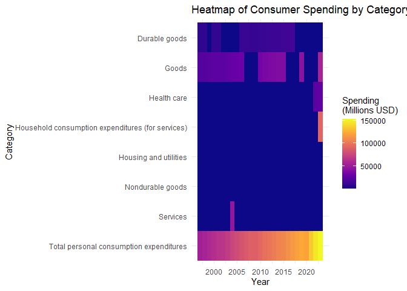

DS 202 Final Project
================

<!-- README.md is generated from README.Rmd. Please edit the README.Rmd file -->

# Analysis of Consumer Spending in Iowa

Authors: Kylie Tauke, Jordyn Reimer, and Akshat Valse

## Abstract (TL;DR)

The data explored in this project details estimates on consumer spending
in the state of Iowa. We wanted to identify what consumers spend the
most on and how it has changed throughout the years. The data comes from
the U.S. Bureau of Economic Analysis.

We found that consumer spending consistently increases over time, which
could be due to multiple things such as inflation, population growth,
economy growth, etc. Consumers spend more on services, dominated by
health care and housing or utility expenses, than goods, which is
dominated by nondurable goods like groceries.

# Motivation

We wanted to examine consumer spending in Iowa. Not only were we curious
about the distribution of spending among different categories of goods
and services, but this is also valuable information for any business
providing a good or service.

# Quick Data Summary

- The data was cleaned by standardizing column names, extracting
  simplified categories from text fields, splitting composite IDs into
  separate columns, converting data types (dates, numbers), normalizing
  units to millions, and removing duplicates.

- The primary variables that will be used will be category, which
  includes the type of good and/or service; reported_year, which is the
  year the consumer data was reported from 1997 to 2023; and value,
  which contains the amount of money spent for a specific category and
  year.

- Total personal consumption expenditures includes all categories across
  goods and services.

  - Services expenditures had two categories, household consumption
    expenditures (for services) and final consumption expenditures of
    nonprofit institutions serving households (NPISHs).

    - NPISH expenditures were generally ignored.

    - Household service expenditures were further split into housing and
      utilities, health care, transportation services, recreation
      services, food services and accommodations, financial services and
      insurance, and other miscellaneous services.

  - Goods expenditures are split into two categories, durable and
    nondurable goods, which are then further split.

    - Durable goods include furnishings and durable household equipment,
      motor vehicles and parts, recreational goods and vehicles, and
      other miscellaneous durable goods.

    - Nondurable goods include food and beverages purchased for
      off-premises consumption, clothing and footwear, gasoline and
      other energy goods, and other miscellaneous nondurable goods.

# Results

## Kylie’s Analysis

<!-- -->

In this graph, we can see that generally, services have higher consumer
expenditures than goods do. However, we see a drop in service
expenditures in 2020, and an increase in goods expenditures in the
following year. COVID clearly impacted consumer spending. Some possible
reasons for this could be a drop in consumer demand for services during
the quarantine period, price increases due to the economy taking a hit
during COVID, consumers stockpiling assorted goods, and more.

<!-- -->

Looking only at goods, nearly every type of good has a relatively steady
increase as time goes on. Some goods, such as clothing, gasoline, and
various durable goods saw a drop in consumer spending in 2020, while
others like food, recreational goods, and other nondurable goods saw an
increase in 2020, so COVID definitely had an impact on consumer
spending. Clearly, gasoline has the most variance in consumer spending,
which makes sense since although demand for gas is probably steady, gas
prices vary a lot.

<!-- -->

These box plots clearly show why service spending is higher than goods
spending. Health care and housing/utilities dominate consumer spending
overall. Then, the next items that consumers spend the most on are
grocery items, included in miscellaneous nondurable goods and also food
and beverages.

## Jordyn’s Analysis

<!-- -->

This suggests a greater share of consumer or economic expenditure goes
toward short-lived products (food, fuel, clothing) compared to
long-lasting items (appliances, cars).

<!-- -->

Typical consumer spending is relatively low, as indicated by the high
frequency of small values and the lower median. The average spending is
misleading as a measure of central tendency here due to a few high
spenders skewing the data. Median is a better indicator of typical
consumer behavior in this dataset. Policy or marketing strategies should
consider the skewness as most consumers behave differently from the few
big spenders.

<!-- -->

Both total and per capita expenditures exhibit a consistent upward trend
over the entire period, indicating increasing spending over time. The
growth for total appears to accelerate more steeply after 2015,
suggesting either increased population, inflation, or expanded services.
Although per_capita is growing steadily, it shows a more gradual slope
compared to total expenditure.

## AK’s Analysis

<!-- -->

<!-- -->

## AK’s Model: Modeling Using Random Forests

<!-- -->

<!-- -->

## AK’s Heatmap: Volatility in Spending Categories Over Time

<!-- -->

# Conclusions

In this project, we explored consumer spending patterns in Iowa using
data from the U.S. Bureau of Economic Analysis. We analyzed overall
spending trends such as spending over time, comparisons between services
and goods, and distributions of spending. We built a random forest model
to predict spending categories based on expenditure and year and
visualized shifts in major spending categories through a heatmap.

Our results show that total consumer spending in Iowa has steadily
increased over the past two decades, which could indicate multiple
things (economy growth, population growth, inflation, etc.) with
essential categories like healthcare and housing consistently dominating
overall expenditures. We found that around the COVID pandemic, services
had a drop in spending before rebounding while goods had an increase
post-COVID.

Within goods, consumers spend more on nondurable goods rather than
durable goods, showing a possible market for businesses in Iowa.
Groceries (food, beverages, and miscellaneous nondurable goods) dominate
the goods spending.

Meanwhile, discretionary categories such as food services and recreation
displayed greater volatility.

One limitation of our analysis is that we did not adjust spending
figures for inflation or population growth, which could affect
year-to-year comparisons. Additionally, our predictive model only used
two variables, and incorporating more economic indicators (such as
unemployment rates, income levels, or demographic shifts) might improve
model accuracy and interpretation. Another limitation is that since the
only value we had was expenditures per category, we could not develop
any insights of related to how much of each category consumers were
buying or the prices of items in each category.

If we had more time or additional team members, we would have liked to
build a forecasting model to predict future consumer spending by
category. We also would have explored spatial differences across
counties in Iowa to investigate whether spending patterns vary
geographically within the state.

## Data source

We got our data from data.gov, which is used to house United States open
datasets. The dataset used provides annual estimates of consumer
spending in Iowa, developed by the U.S. Bureau of Economic Analysis.

## References

Link to data:
<https://catalog.data.gov/dataset/annual-personal-consumption-expenditures-for-state-of-iowa>
